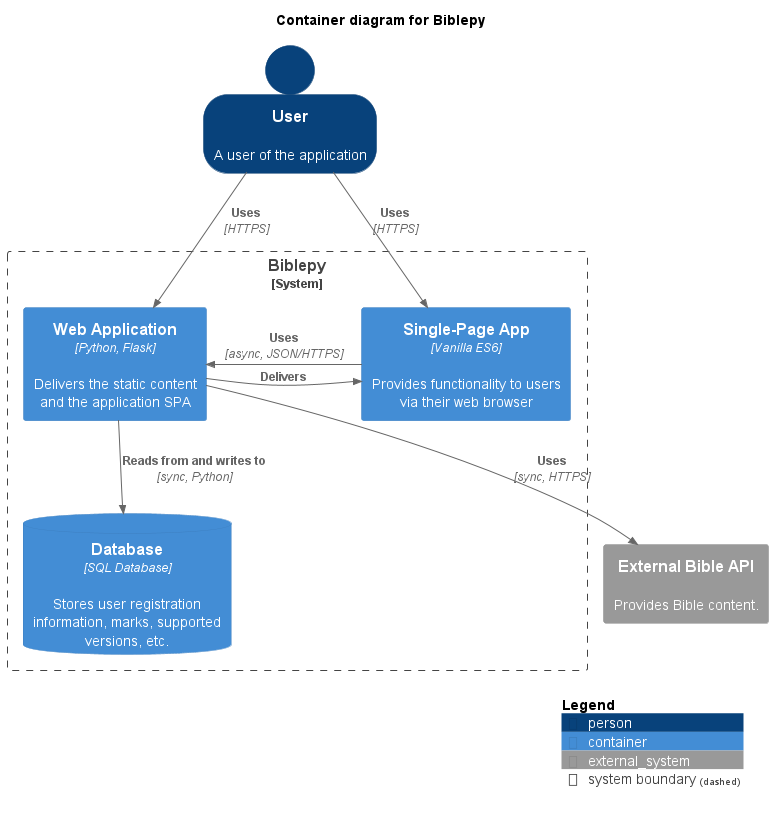
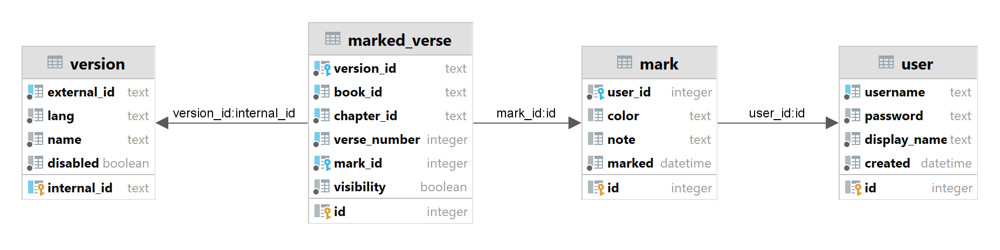

# Biblemark

Biblemark is a web application designed to enhance your Bible reading experience
by allowing you to engage with the text through highlights and notes.
This is my final project for the CS50's Introduction to Computer Science course,
which I participated as a student in the more comfortable category.

Check out a quick demo on YouTube: [Watch Demo](https://youtu.be/OI3Zq906a80)

## Domain context

There are numerous Bible versions that vary in language and also in structure.
Each version comprises a collection of books, historically organized into chapters and verses.
However, it's important to note that not all books or chapters contain scriptural content;
some may include extra material books or introduction chapters.

A verse is the smallest distinct unit and can be uniquely identified
by a combination of version, book, chapter, and verse number.
Abbreviations are commonly used for versions and books,
and a consistent referencing format exists,
with some variations depending on location.

While reading the Bible, highlighting certain passages
with a color-coded system has become a common practice,
and also appending personal notes alongside verses.

These are the focal point of the application.

## Key features

- Highlighting and adding notes to individual verses or groups of verses.
- Adding multiple notes to the same verse or group of verses.
- Cross-version and cross-chapter highlighting and note capabilities.
- Easily visualizing notes alongside the Bible content.
- Utilizing multiple highlight colors and accommodating lengthy notes.

## Architecture



### Design decisions

- Adhering to the technology stack covered by the CS50 course for consistency,
not considering libraries such as SQLAlchemy, React, or similar frameworks.
- Reducing project scope by fetching Bible content externally, and
disregarding resilience, and account-related features.
- Simplifying the marking features for low code complexity, avoiding
user-defined colors, word selection, and referencing selected verses.
- Establishing a clear separation that isolates domain models, but
without Hexagonal Architecture or similar approaches to prevent over-engineering.

Technical debts:

- Missing automated tests.
- No token-based authentication for API endpoints.
- Incomplete validation of user input in certain scenarios.

---

### Frontend

The frontend is server-side rendered using [Jinja2](https://github.com/pallets/jinja) templates.
Nonetheless, the primary application page extensively relies on client-side operations,
executing asynchronous requests to the API endpoints defined in the backend.
This aspect qualifies this section as a single-page application.
It is also based on the MVC pattern.

It does not utilize React or analogous frameworks.
Instead, it is exclusively built using Vanilla ES6,
complemented with styles from
[Bootstrap](https://github.com/twbs/bootstrap).

The frontend is organized into the followed layers:

- **model:** stores data of Bible navigation and content, marks, and selected verses.
- **view:** displays Bible navigation and content, marks and controls, notifications, etc.
- **controller:** acts as an intermediary between the view and the model.

For more details, refer to the JSDoc and other comments.

---

### Backend

The backend works on top of [Flask](https://github.com/pallets/flask),
a Python micro framework for building web applications.

The backend is organized into the followed layers:

- **controller:** web routes and API endpoints.
- **converter:** data conversion and HATEOAS.
- **exceptions:** custom exceptions extending [HTTPException](https://werkzeug.palletsprojects.com/en/2.3.x/exceptions).
- **middleware:** request interceptors for authentication, data transformation, etc.
- **model:** domain models.
- **repository:** data access layer.
- **service:** business logic.
- **utils:** helper functions and utilities.

For more details, check the Python docstrings and other comments.

---

### External API

This project depends on a registered application (and its secret key)
in [API.Bible](https://docs.api.bible) by the American Bible Society (ABS),
which offers free usage, clear documentation, pre-rendered HTML and
[CSS stylesheets](https://docs.api.bible/tutorials/styling-scripture).

The API provides access to an extensive collection
of versions available in multiple languages.
As of the time of writing this documentation,
the Basic plan permits up to 5000 hits per day.

One encountered challenge was the latency when fetching a batch of passages,
as defined by the [API reference](https://scripture.api.bible/livedocs).
This functionality is essential for enriching the marks on the
`/highlights` or `/notes` web routes.

This challenge was addressed through the following strategies:

- fetching concurrently, using a `ThreadPoolExecutor`;
- caching responses,
using [Flask-Caching](https://github.com/pallets-eco/flask-caching) with `FileSystemCache`;
- paginating results, using `LIMIT` and `OFFSET` for now.

---

### Database

The relational database structure is defined in the [`schema.sql`](schema.sql) file.



The version table establishes a connection between
the IDs of chosen versions sourced from the external API
and the internally distinct abbreviations utilized as internal IDs.
This approach resolves cases where versions share the same abbreviation,
provides greater control over supported versions,
and improves the clarity of text keys for versions.
However, it has the trade-off of increased coupling with the external API.

The selected version mapping is inserted with [`data.sql`](data.sql).

---

## How to run

### Environment

Set the environment variables in an `.env` file with the required:

- Flask `SECRET_KEY`: you can use a random text.
- API.Bible `API_BIBLE_APP_KEY`: from a registered application at
[API.Bible](https://scripture.api.bible/signup) (free).

Then create a virtual environment and activate it.

macOS / Linux:

```shell
python3 -m venv .venv
. .venv/bin/activate
```

Windows:
    
```shell
py -3 -m venv .venv
.\.venv\Scripts\activate
```

### Application

Create database schema and populate supported versions:

```shell
flask --app biblemark init-db
```

Start the application:

```shell
flask --app biblemark run
```

Clean the cache:

```shell
flask --app biblemark clear-cache
```
